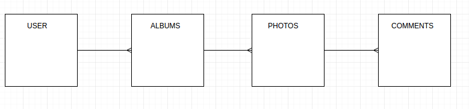

##### a photosharing app
(not that there arent already a crap ton)

[link to api repo](https://github.com/estermer/nitpic-api)

---

[General Assembly WDIR](https://generalassemb.ly/) Unit_04 Project

Contributers:

  [Aaron Ballard](https://github.com/mraballard)

  [Sean Robbins](https://github.com/starvingartist88)

  [Eric Stermer](https://github.com/estermer)

---

## App Overview
Users will be able to register and create albums and photos. Albums and photos will need to be named and described by their owners. Users will be able to view other user's' albums. Maybe users can comment on photos, or either up/down vote them.

## Data Model

## User Stories

+ As a new user, I can register a new account
+ If I have an account I can log in and log out
+ As a logged in user, I can upload photos
+ As a logged in user, I can create photo albums with new photos or already uploaded photos
+ I can click on a photo in an album and it brings me to a larger version of that photo
+ When looking at an enlarged photo I can leave a comment on the photo
+ If I do not like my comment I can remove the comment
+ As a user I can remove photos from my albums
+ As a user or guest, I can search albums of users and view their photos

## Wireframe

insert photo/photos here

## Daily Progress

#### Day 1
Spent the first night after class shooting around ideas of what project we wanted to create. First we were thinking about a sound share app, but in our limited time learning AWS and a media player functionality would be too much. So we decided on a picture sharing app, sort of like an imagur or instagram. Took some time to think of a name and set up the GitHub and Trello Team to collaborate. It was a very short night.

#### Day 2
Took most of the morning and afternoon to really nail down the Data modeling for our app, considering our MVP and our potential reach goals. After taking an afternoon of going over technical interviews with a guest speaker, Aaron and Eric did some pair programming to knock out the initial rails api up to the controllers and routes. Arron also set up a skeleton for the angular ui. 

#### Day 3
Aaron worked on finishing up the controllers, Sean worked on the angular partials for the layout and som initial views, and Eric worked on getting the AWS S3 and paperclip working to enable photo upload. Today was a long day for all three of us. Aaron expreience problems with getting user authentication to work, sean had merge conflict errors that was duplicating his html and css code. And Eric with getting through uploading a file through first angular to send to the backend and then validate it to upload it to AWS S3. Both Aaron and Eric got over their hump before they called it a day, Sean had made some decent progress fixing his styles. If user auth is done then the rails API is completed.
